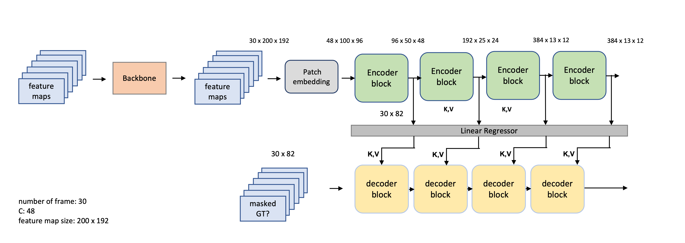
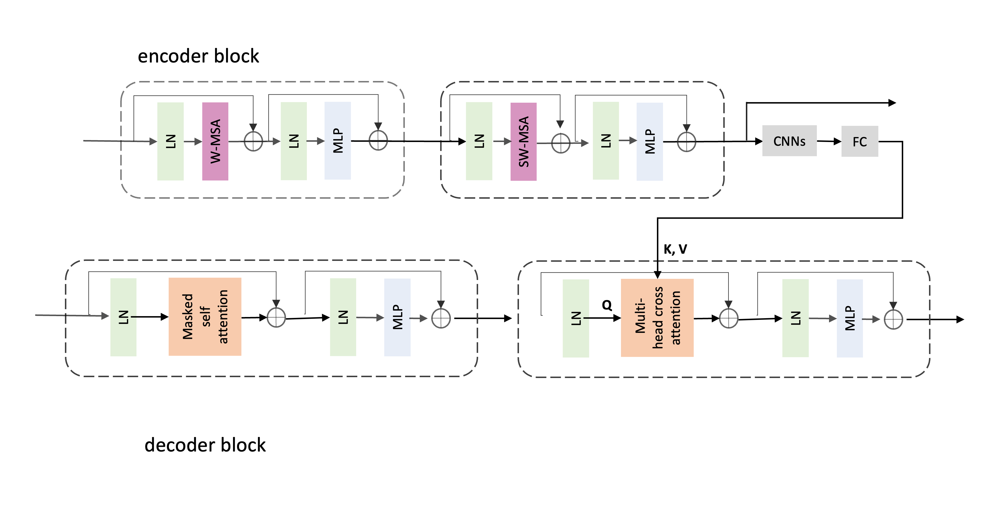

# D3Pose - Double-Masked Encoder-Decoder model for video mesh recovery 

This research project aims to beat SOTA models on video mesh recovery with a novel cross-attention transformer-based model.

## Usage

install the following dependencies

```bash
CLIP
python 3.8
pip install torch
pip install numpy
pip install torchvision
pip install scikit-image
pip install timm


```

## Pipeline


Inspired by the [vanilla transformer](https://arxiv.org/pdf/1706.03762.pdf) in NLP. This paper utilizes an encoder-decoder architecture to strengthen temporal smoothness. The vanilla self-attention module is replaced by the swin transformer module.



## References

- check out [this](references/References.md) for a comprehensive list of SOTA model in mesh recovery.
- the code base is partially inspired by [this](https://github.com/aladdinpersson/Machine-Learning-Collection/tree/master/ML/Pytorch/more_advanced/transformer_from_scratch)

## To-dos

- train the basic cross-attention model on H36M with NeuralAnnot annotations
- train the basic cross-attention model on an expanded dataset
- designed the swin-transformer cross-attention model
